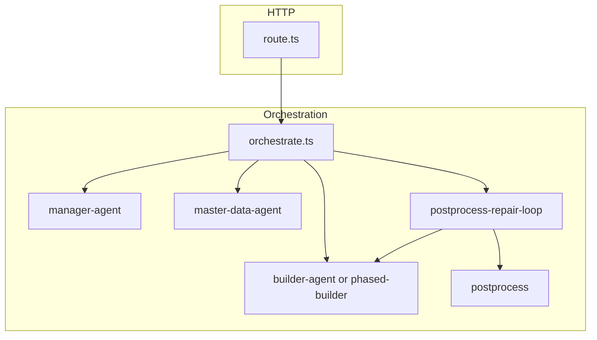

# Build-tracker agent (`/api/agent/build-tracker`)

Multi-phase LLM pipeline that turns a natural-language request into a **tracker schema** (tabs, sections, grids, fields, bindings, rules), streamed to the client as **NDJSON**.

## HTTP contract

- **Route:** [`route.ts`](./route.ts) — `POST`, authenticated, body matches tracker generation endpoints (see `parseRequestBody` in `@/lib/tracker-prompt/validation`).
- **Response:** `Content-Type: application/x-ndjson` — one JSON object per line (`AgentStreamEvent`). Decode with [`decodeEvent`](../../../../lib/agent/events.ts) or the client hook [`useAgentStream`](../../../../app/tracker/hooks/useAgentStream.ts).

Wire events are defined in [`lib/agent/events.ts`](../../../../lib/agent/events.ts); **do not rename** event `t` values without updating the client.

## Pipeline (high level)



1. **Manager** — `ManagerSchema`: PRD, `builderTodo`, optional `requiredMasterData`, optional `buildManifest` (machine checklist for large builds).
2. **Master data** (module/project scope only) — resolves external tracker IDs before the builder runs.
3. **Builder** — produces `tracker` or `trackerPatch` (+ optional `masterDataTrackers` in tracker scope path B).
4. **Postprocess** — bindings, expression intents, validation; **repair loop** may re-invoke the builder on failures (bounded).

## Modules (where to change what)

| Area | Primary files |
|------|----------------|
| Token limits & repair counts | [`lib/constants.ts`](./lib/constants.ts) — **`BUILDER_MAX_TOKENS` must stay ≤ DeepSeek Chat max (8192)** |
| User/system prompt text | [`lib/prompts.ts`](./lib/prompts.ts) |
| Manager LLM | [`lib/manager-agent.ts`](./lib/manager-agent.ts) |
| Builder LLM (stream + fallbacks) | [`lib/builder-agent.ts`](./lib/builder-agent.ts) |
| Large greenfield builds | [`lib/phased-builder.ts`](./lib/phased-builder.ts) — skeleton + `trackerPatch` |
| Completeness heuristics | [`lib/agent/build-tracker-completeness.ts`](../../../../lib/agent/build-tracker-completeness.ts) |
| Repair prompt draft JSON | [`lib/agent/build-tracker-repair-draft.ts`](../../../../lib/agent/build-tracker-repair-draft.ts) |
| Error strings (no heavy imports) | [`lib/agent/build-tracker-errors.ts`](../../../../lib/agent/build-tracker-errors.ts) |
| Postprocess + binding strip | [`lib/postprocess.ts`](./lib/postprocess.ts) |
| Postprocess + builder repairs | [`lib/postprocess-repair-loop.ts`](./lib/postprocess-repair-loop.ts) |
| Thin coordinator | [`lib/orchestrate.ts`](./lib/orchestrate.ts) |

## Operational constraints

- **DeepSeek `max_tokens`:** Capped at **8192** (`DEEPSEEK_CHAT_MAX_OUTPUT` in `@/lib/ai/config`). [`clampBuilderMaxOutputTokens`](./lib/constants.ts) enforces this for every builder call.
- **Phased builder:** Used only for **greenfield** builds (no full tracker patch context) when `builderTodo` length or user query length crosses thresholds in `constants.ts`.
- **Binding integrity:** Invalid bindings may be **stripped** with `binding-stripped-*` tool call entries rather than failing the whole request; see `postprocess.ts`.

## Tests

Vitest colocated under [`lib/__tests__/`](./lib/__tests__/). Run:

```bash
npx vitest run --config vitest.unit.config.ts app/api/agent/build-tracker/lib/__tests__/
```

## Related

- AI project single-shot flow: `app/api/ai-project/build-tracker` (different stack; not automatically kept in sync).
