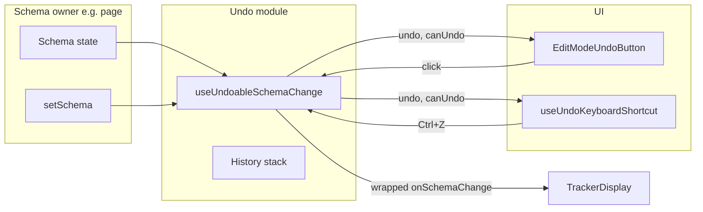

# Edit Mode Undo

Modular undo for tracker layout edits in edit mode. Lets users revert the last schema change (add/remove/reorder sections, grids, fields, tabs, renames, etc.) via a button or **Ctrl+Z** / **Cmd+Z**.

## What it is

- **History stack**: Before each schema change, the current schema is pushed onto a stack (max 50 steps). Undo pops the last schema and applies it.
- **UI**: An "Undo" button (optional) and a global keyboard shortcut **Ctrl+Z** (Windows/Linux) or **Cmd+Z** (macOS).
- **Scope**: Only affects layout/schema changes made in edit mode (tabs, sections, grids, fields, validations, calculations). Does not touch grid data or chat.

## How it works



1. **Schema owner** (e.g. tracker page) holds `schema` and a handler `onSchemaChange(next)`.
2. **useUndoableSchemaChange** wraps that handler: on each change it pushes the current schema onto a ref-held stack, then calls the real `onSchemaChange(next)`. It exposes:
   - `onSchemaChange` – pass this to `TrackerDisplay` instead of the raw handler.
   - `undo` – call to revert one step.
   - `canUndo` – whether the stack has at least one step.
3. **EditModeUndoButton** renders an "Undo" button that calls `undo()` when `canUndo`; hide when not in edit mode or when `undo` is undefined.
4. **useUndoKeyboardShortcut(editMode, canUndo, undo)** registers a window keydown listener for Ctrl+Z/Cmd+Z and calls `undo()` when edit mode is on and `canUndo` is true.

## Files

| File | Role |
|------|------|
| **useUndoableSchemaChange.ts** | Hook that maintains the undo stack and wraps `onSchemaChange`. |
| **useUndoKeyboardShortcut.ts** | Hook that binds Ctrl+Z / Cmd+Z to `undo`. |
| **EditModeUndoButton.tsx** | Button component that calls `undo` and shows "Undo (Ctrl+Z)". |
| **index.ts** | Exports useUndoableSchemaChange, EditModeUndoButton, useUndoKeyboardShortcut. |

Context (`EditModeProvider`) can optionally receive `undo` and `canUndo` so any child can call `useEditMode().undo()` or show UI; the toolbar often lives outside the provider, so the page passes `undo`/`canUndo` into the button and the keyboard hook.

## Usage

**1. In the schema owner (e.g. tracker page):**

```tsx
const handleSchemaChange = useCallback((next) => {
  setSchema(next)
  // ... e.g. sync to server
}, [])

const undoable = useUndoableSchemaChange(schema, handleSchemaChange)

// When in edit mode, pass the wrapped handler and undo state:
<TrackerDisplay
  {...schema}
  editMode={editMode}
  onSchemaChange={editMode ? undoable.onSchemaChange : undefined}
  undo={editMode ? undoable.undo : undefined}
  canUndo={editMode ? undoable.canUndo : false}
/>
```

**2. In the toolbar (same page or parent):**

```tsx
useUndoKeyboardShortcut(editMode, undoable.canUndo, undoable.undo)

<EditModeUndoButton
  undo={editMode ? undoable.undo : undefined}
  canUndo={editMode ? undoable.canUndo : false}
  visible={editMode}
/>
```

Place the button where it fits your layout (e.g. next to other toolbar actions like "Data" or "Structure").

## Options

- **useUndoableSchemaChange(schema, onSchemaChange, { maxHistorySize })**  
  `maxHistorySize` defaults to 50. Increase or decrease to cap memory.

## Future

- **Redo**: Add a redo stack; clear it on any new user change; expose `redo` / `canRedo` and optionally Ctrl+Shift+Z.
- **Keyboard in context**: If the toolbar is inside `EditModeProvider`, a child could call `useEditMode().undo` and use the same keyboard hook with those values.
