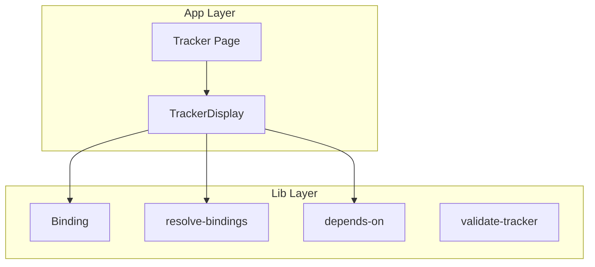

# Architecture Overview

High-level structure of the Trckr application and how its main pieces fit together.

## Data Flow

- **Tracker Page** (`/tracker`) — Chat UI and streaming generation. Uses `useTrackerChat` for state; renders `TrackerDisplay` when a tracker is generated.
- **TrackerDisplay** — Renders the tracker schema: tabs, sections, grids (table, kanban, div). Consumes `gridData` and callbacks from the parent; never owns persistence.
- **Binding** — Resolves select/multiselect options from bindings, grid data, or dynamic functions.
- **resolve-bindings** — Path parsing, grid data access, applying bindings when options are chosen.
- **depends-on** — Conditional field rules: hide, require, disable, set value based on other field values.
- **validate-tracker** — Schema integrity validation and auto-fix.

## Module Layout

| Path | Role |
|------|------|
| `app/tracker/` | Route, hooks (`useTrackerChat`), merge utils |
| `app/components/tracker-display/` | TrackerDisplay, grids, TrackerCell, types |
| `app/components/tracker-page/` | Tracker dialog, message list, input, empty state |
| `app/components/landing-page/` | Hero, Demo, Features, CTA |
| `components/ui/` | Shared primitives (button, dialog, select, table, etc.) |
| `lib/binding/` | Build and enrich bindings; resolve field options |
| `lib/resolve-bindings/` | Parse paths, apply bindings, initial grid data |
| `lib/depends-on/` | Index, query, resolve depends-on overrides |
| `lib/depends-on-options/` | Shared-tab depends-on rules grid |
| `lib/dynamic-options/` | Dynamic select/multiselect option functions |
| `lib/validate-tracker/` | Layout, options, bindings, depends-on validation |
