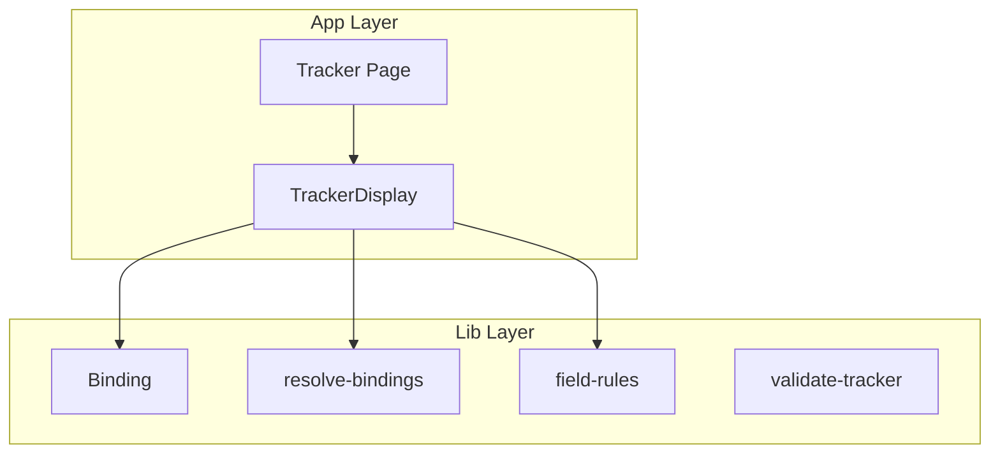

# Architecture Overview (Legacy Entry)

This file is kept for backward compatibility. The maintained architecture docs now live in:

- [`docs/README.md`](./README.md)
- [`docs/architecture/system-overview.md`](./architecture/system-overview.md)
- [`docs/architecture/module-boundaries.md`](./architecture/module-boundaries.md)
- [`docs/architecture/data-flow.md`](./architecture/data-flow.md)

The sections below summarize the same high-level architecture.

## Data Flow

```mermaid
flowchart TB
  subgraph App [App Layer]
    Page[Tracker Page]
    TrackerDisplay[TrackerDisplay]
  end
  subgraph Lib [Lib Layer]
    Binding[Binding]
    ResolveBindings[resolve-bindings]
    FieldRules[field-rules]
    Validate[validate-tracker]
  end
  Page --> TrackerDisplay
  TrackerDisplay --> Binding
  TrackerDisplay --> ResolveBindings
  TrackerDisplay --> FieldRules
```

- **Tracker Page** (`/tracker`) — Chat UI and streaming generation. Uses `useTrackerChat` for state; renders `TrackerDisplay` when a tracker is generated.
- **TrackerDisplay** — Renders the tracker schema: tabs, sections, grids (table, kanban, div). Consumes `gridData` and callbacks from the parent; never owns persistence.
- **Binding** — Resolves select/multiselect options from bindings, grid data, or dynamic functions.
- **resolve-bindings** — Path parsing, grid data access, applying bindings when options are chosen.
- **field-rules** — Conditional field rules: hide, require, disable based on other field values.
- **validate-tracker** — Schema integrity validation and auto-fix.

## Module Layout

| Path | Role |
|------|------|
| `app/tracker/` | Route, hooks (`useTrackerChat`), merge utils |
| `app/components/tracker-display/` | TrackerDisplay, grids, TrackerCell, types |
| `app/components/tracker-page/` | Tracker dialog, message list, input, empty state |
| `app/components/landing-page/` | Hero, Demo, Features, CTA |
| `components/ui/` | Shared primitives (button, dialog, select, table, etc.) |
| `lib/binding/` | Build and enrich bindings; resolve field options |
| `lib/resolve-bindings/` | Parse paths, apply bindings, initial grid data |
| `lib/field-rules/` | Index, query, resolve field rule overrides |
| `lib/field-rules-options/` | Shared-tab field rules grid |
| `lib/dynamic-options/` | Dynamic select/multiselect option functions |
| `lib/validate-tracker/` | Layout, options, bindings, field rules validation |
