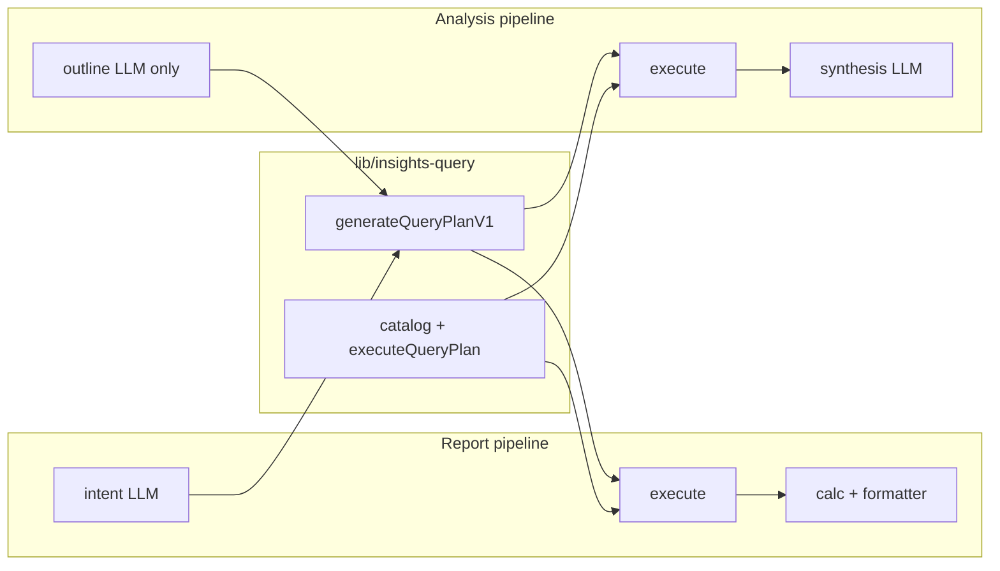

# Insights pipeline (reports & analyses)

Shared server and client pieces for **tracker-backed insights**: field catalog → `QueryPlanV1` → `executeQueryPlan`, then product-specific formatting (reports) or synthesis (analyses).

## Architecture

## Server

| Concern | Location |
|--------|----------|
| Shared query execution + schemas + row load | [`lib/insights-query`](../insights-query/README.md) (`generateQueryPlanV1`, `executeQueryPlan`, `loadTrackerDataForQueryPlan`, …) |
| Query AST rules (single source of truth for the query-plan model) | `lib/prompts/report-query-plan.ts` (`getReportQueryPlanSystemPrompt`) |
| Report orchestration (intent, calc, formatter) | `lib/reports/orchestrator.ts` |
| Analysis outline schema (no embedded query plan) | `lib/analysis/analysis-schemas.ts` (`analysisOutlineOnlySchema`) |
| Analysis orchestration | `lib/analysis/orchestrator.ts` |
| Traced NDJSON runs (DB + stream) | `lib/insights/with-traced-run.ts` (`withTracedRun`) |

LLM usage sources include `report-query-plan`, `analysis-query-plan`, `analysis-planning`, `analysis-synthesis`, etc., so dashboards can split costs by step.

## Client

| Concern | Location |
|--------|----------|
| Phase timeline state + NDJSON reader | `app/insights/lib/ndjson-timeline.ts` (`applyPhaseStreamEvent`, `consumeInsightNdjsonStream`) |
| Timeline UI | `app/insights/components/GenerationTimeline.tsx` |
| Page chrome (header, stale banner, prompt shell) | `app/insights/components/InsightPageHeader.tsx`, `StaleDefinitionBanner.tsx`, `InsightPromptCard.tsx` |
| Multiline prompt (report + analysis) | `app/insights/components/InsightMultilinePrompt.tsx` |
| New report/analysis dialog | `app/insights/components/NewTrackerBackedItemDialog.tsx` |

Report-only UI (e.g. recipe filters) and analysis-only UI (document view) stay on their respective pages.

## Out of scope here

- Merging report and analysis **API routes** (separate resources).
- Sharing **formatter/calc** with analysis (different outputs).
- **Per-section query plans** (future extension to `generateQueryPlanV1`).
